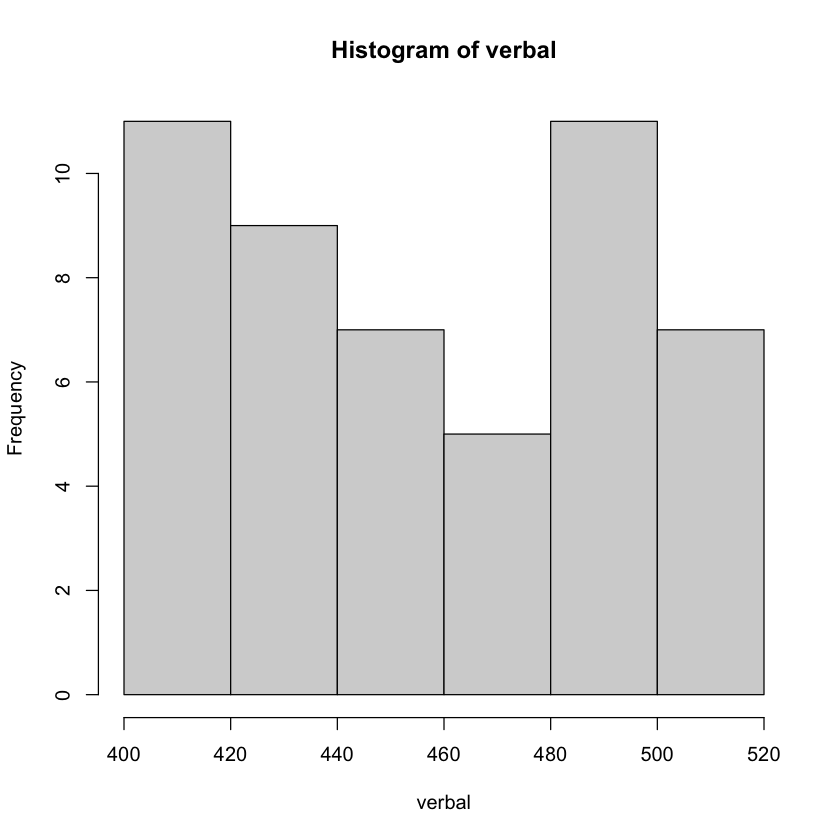
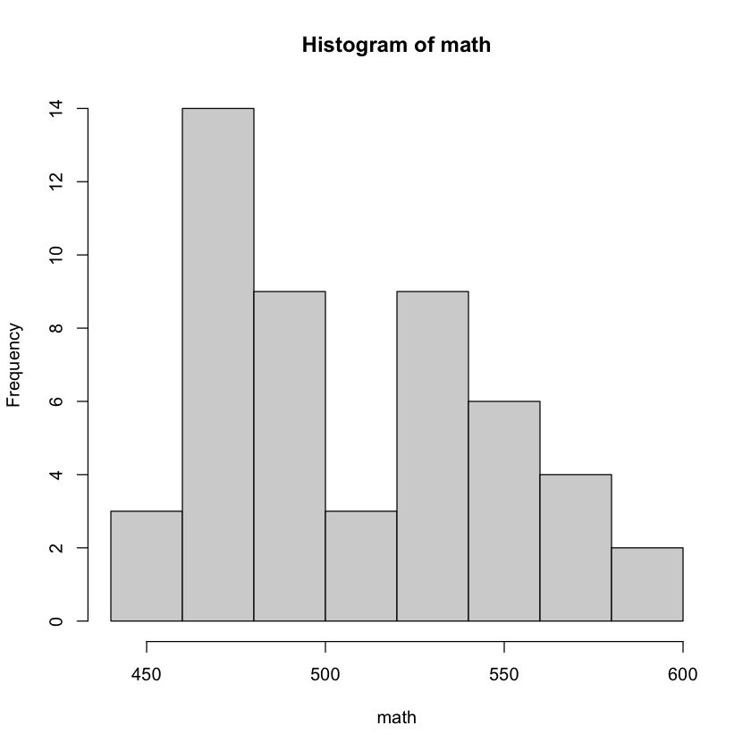
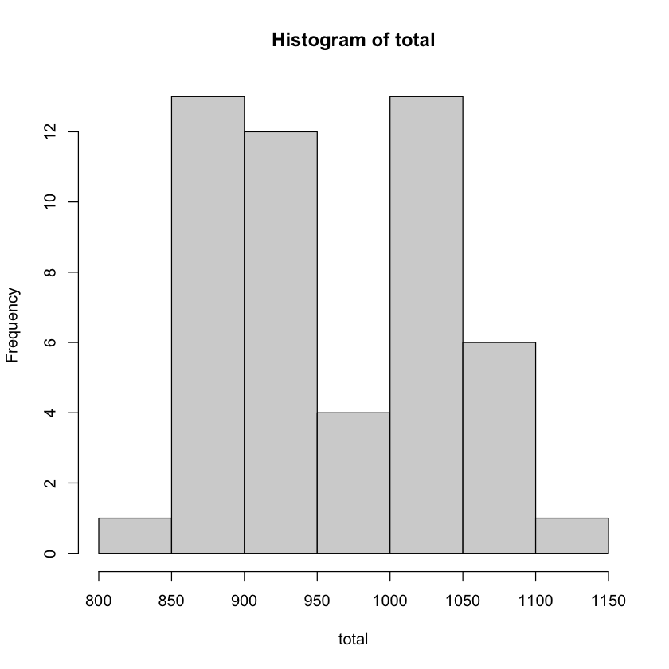
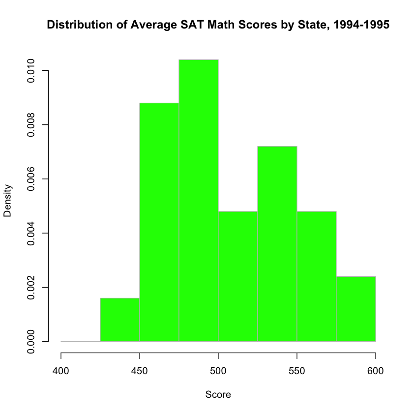

# Histograms

For this lab we will be using some real world data to create histograms. A histogram is a graphical display of data using bars of different heights. In a histogram, each bar groups numbers into ranges (these ranges are sometimes called bins or classes). Taller bars show that more data falls in that range. A histogram displays the shape and spread of sample data.

Before we get into creating our histograms, let's load some libraries and data into our workspace.


```R
library(tidyverse)
library(mosaicData)
library(nycflights13)
```

    ── Attaching packages ─────────────────────────────────────── tidyverse 1.3.0 ──
    
    ✔ ggplot2 3.3.3     ✔ purrr   0.3.4
    ✔ tibble  3.0.4     ✔ dplyr   1.0.2
    ✔ tidyr   1.1.2     ✔ stringr 1.4.0
    ✔ readr   1.4.0     ✔ forcats 0.5.0
    
    ── Conflicts ────────────────────────────────────────── tidyverse_conflicts() ──
    ✖ dplyr::filter() masks stats::filter()
    ✖ dplyr::lag()    masks stats::lag()
    


The mosaicData library has a data set called SAT. Most datasets in R come with documentation. This documentation includes a list of all variables, descriptions of the variables, information about how the data was collected, and references to the data source. To view this information you can use `help([NAME_OF_DATASET])`. Using the command `help(SAT)` will open a new page with the information below.


```R
help(SAT)
```

> SAT {mosaicData}	R Documentation
> ## State by State SAT data
>
> ### Description
SAT data assembled for a statistics education journal article on the link between SAT scores and measures of educational expenditures
>
> ### Usage
>
> `data(SAT)`
>
> ### Format
>
> A data frame with 50 observations on the following variables.
> - `state` a factor with names of each state
> - `expend` expenditure per pupil in average daily attendance in public elementary and secondary schools, 1994-95 (in > thousands of US dollars)
> - `ratio` average pupil/teacher ratio in public elementary and secondary schools, Fall 1994
> - `salary` estimated average annual salary of teachers in public elementary and secondary schools, 1994-95 (in thousands of US dollars)
> - `frac` percentage of all eligible students taking the SAT, 1994-95
> - `verbal` average verbal SAT score, 1994-95
> - `math` average math SAT score, 1994-95
> - `sat` average total SAT score, 1994-95
>
> ### Source
>
> http://www.amstat.org/publications/jse/secure/v7n2/datasets.guber.cfm
>
> ### References
>
> Deborah Lynn Guber, "Getting what you pay for: the debate over equity in public school expenditures" (1999), Journal of Statistics Education 7(2).
>
> ### Examples
> ```R
> data(SAT)
>if (require(ggformula)) {
>  gf_point(sat ~ expend, data = SAT, color = "blue", alpha = 0.5) %>%
>    gf_lm()
>  gf_text(sat ~ expend, data = SAT, label = ~ abbreviate(SAT$state, 3),
>    inherit = FALSE)
> }
> ```


If you want a shorter description of data you can use the `head([NAME_OF_DATASET])` or `str([NAME_OF_DATASET])` commands


```R
head(SAT)
```


<table>
<caption>A data.frame: 6 × 8</caption>
<thead>
	<tr><th></th><th scope=col>state</th><th scope=col>expend</th><th scope=col>ratio</th><th scope=col>salary</th><th scope=col>frac</th><th scope=col>verbal</th><th scope=col>math</th><th scope=col>sat</th></tr>
	<tr><th></th><th scope=col>&lt;fct&gt;</th><th scope=col>&lt;dbl&gt;</th><th scope=col>&lt;dbl&gt;</th><th scope=col>&lt;dbl&gt;</th><th scope=col>&lt;int&gt;</th><th scope=col>&lt;int&gt;</th><th scope=col>&lt;int&gt;</th><th scope=col>&lt;int&gt;</th></tr>
</thead>
<tbody>
	<tr><th scope=row>1</th><td>Alabama   </td><td>4.405</td><td>17.2</td><td>31.144</td><td> 8</td><td>491</td><td>538</td><td>1029</td></tr>
	<tr><th scope=row>2</th><td>Alaska    </td><td>8.963</td><td>17.6</td><td>47.951</td><td>47</td><td>445</td><td>489</td><td> 934</td></tr>
	<tr><th scope=row>3</th><td>Arizona   </td><td>4.778</td><td>19.3</td><td>32.175</td><td>27</td><td>448</td><td>496</td><td> 944</td></tr>
	<tr><th scope=row>4</th><td>Arkansas  </td><td>4.459</td><td>17.1</td><td>28.934</td><td> 6</td><td>482</td><td>523</td><td>1005</td></tr>
	<tr><th scope=row>5</th><td>California</td><td>4.992</td><td>24.0</td><td>41.078</td><td>45</td><td>417</td><td>485</td><td> 902</td></tr>
	<tr><th scope=row>6</th><td>Colorado  </td><td>5.443</td><td>18.4</td><td>34.571</td><td>29</td><td>462</td><td>518</td><td> 980</td></tr>
</tbody>
</table>


```R
str(SAT)
```

    'data.frame':	50 obs. of  8 variables:
     $ state : Factor w/ 50 levels "Alabama","Alaska",..: 1 2 3 4 5 6 7 8 9 10 ...
     $ expend: num  4.41 8.96 4.78 4.46 4.99 ...
     $ ratio : num  17.2 17.6 19.3 17.1 24 18.4 14.4 16.6 19.1 16.3 ...
     $ salary: num  31.1 48 32.2 28.9 41.1 ...
     $ frac  : int  8 47 27 6 45 29 81 68 48 65 ...
     $ verbal: int  491 445 448 482 417 462 431 429 420 406 ...
     $ math  : int  538 489 496 523 485 518 477 468 469 448 ...
     $ sat   : int  1029 934 944 1005 902 980 908 897 889 854 ...


The `head()` command gives the columns and the first few rows of a dataset while the `str()` command lists the the number of rows (cakked obs. or observations), the number of columns (called variables), the column names, the column type, and some observations from each column.

The `SAT` dataset came preloaded when we imported the `MosaicData` library. However, sometimes you may need to load data using the `data([NAME_OF_DATASET])` command. 

## hist function

The `hist()` function has two inputs `hist(x, options)`

### Arguments
An argument of a function is an input for the function. Some arguments are required and some are optional. In the case of the `hist()` function there is only one required argument.

`x`: *a vector of values for which the histogram is desired*


The other arguments have defaults, but can be set by the user if necessary.

### Options
`breaks`: *a numerical object to set breakpoints of the histogram*	
> *one of:*
> - *a vector giving the breakpoints between histogram cells,*
> - *a function to compute the vector of breakpoints,*
> - *a single number giving the number of cells for the histogram,*
> - *a character string naming an algorithm to compute the number of cells (see ‘Details’),*
> - *a function to compute the number of cells.*

`main,xlab,ylab`: *the labels for the histogram, x axis, and y axis*  
`xlim, ylim`: *the range of x and y values*  
`col`: *a color used to fill in the bars*  
`border`: *the color of the border around the bars*  

The information I have given here is a brief description of the function. For the full details you can view the documentation by using the `help(hist)` command. For a general function this would be `help([NAME_OF_FUNCTION])`


```R
help(hist)
```

## Creating a Histogram

Using the `str()` command we can see a list of all the columnns in the data frame as well as a sample of the entries in those columns. Since the input for `hist()` is a vector and not a data frame, this means that we need to create a vector from the SAT data frame with the data we want. 

We will make three vectors for math, verbal, and overall scores.


```R
verbal <- SAT$verbal
math <- SAT$math
total <- SAT$sat
```

Now we have three vectors each with 50 entries that summarize the SAT scores for all US state in 1994-1995. Let's create the histograms.


```R
hist(verbal)
hist(math)
hist(total)
```











Let's create a density plot of the math scores that has bin widths of 25, green bars, and gray borders. We might also want to have more descriptive labels.


```R
hist(math, breaks = seq(400, 600, 25),col = 'green', border = 'gray', freq = FALSE, xlab = 'Score', main = 'Distribution of Average SAT Math Scores by State, 1994-1995')
```





Finally notice that our code has run quite long. It is currently 151 characters. This makes code very hard to read. Each coding language has its own style regarding character per line, but the languages we will be using have 
- python: 79 characters
- R: 80 characters

In order to make our lives easier and be consistent across the board, I am going to say that we will limit our characters per line to 80. 

From the R style guide, https://style.tidyverse.org/, we have the following recommendation:

>Strive to limit your code to 80 characters per line. This fits comfortably on a printed page with a reasonably sized font. If you find yourself running out of room, this is a good indication that you should encapsulate some of the work in a separate function.
>If a function call is too long to fit on a single line, use one line each for the function name, each argument, and the closing ). This makes the code easier to read and to change later.


```R
hist(
     math, 
     breaks = seq(400, 600, 25), 
     col = 'green', 
     border = 'gray', 
     freq = FALSE, 
     xlab = 'Score', 
     main = 'Distribution of Average SAT Math Scores by State, 1994-1995' 
    )
```


```R
help(flights)
```


```R

```
